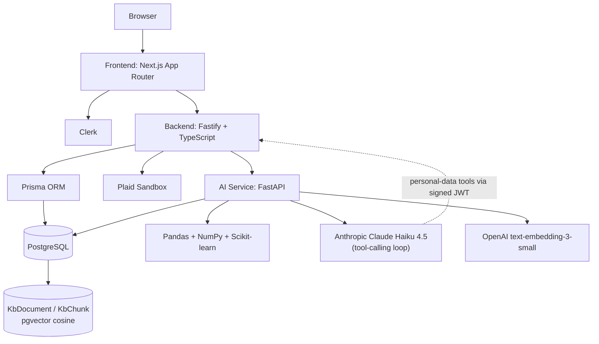
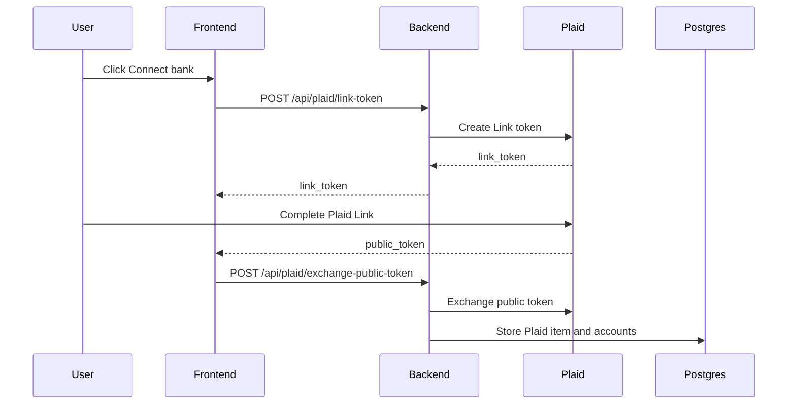
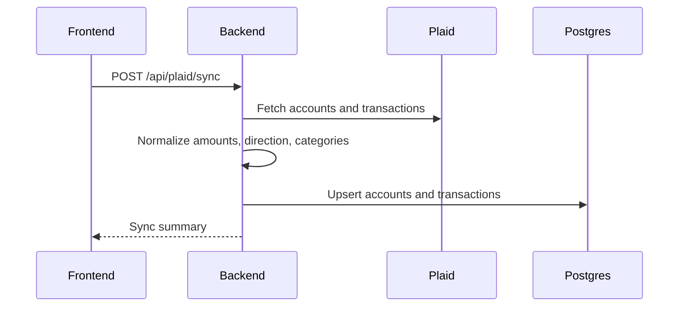
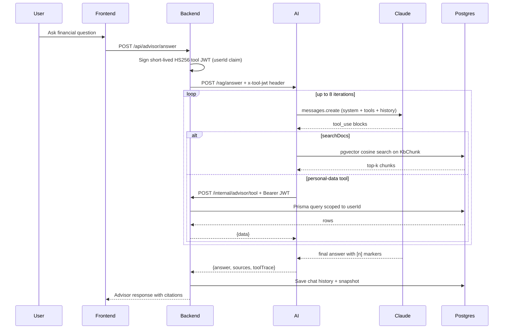

# WealthLens Architecture

WealthLens is a three-service financial analytics product. The frontend handles product experience, the backend owns auth-aware data orchestration, and the Python service owns forecasting, scoring, anomaly detection, and LLM grounding.

## High-Level System

## Service Boundaries

### Frontend

The frontend is responsible for the user-facing product:

- Landing page and public demo mode
- Clerk sign-in and sign-up pages
- Authenticated app shell and sidebar navigation
- Dashboard, transactions, subscriptions, health, advisor, reports, and settings pages
- Plaid Link launch flow
- Recharts visualizations
- Advisor chat interface and report presentation

The frontend talks only to the backend API. It does not call Plaid, PostgreSQL, Anthropic, or OpenAI directly.

### Backend

The backend is the trusted application layer:

- Verifies Clerk sessions
- Upserts Clerk users into PostgreSQL
- Creates Plaid Link tokens
- Exchanges Plaid public tokens for access tokens
- Syncs Plaid accounts, balances, and transactions
- Normalizes financial records into Prisma models
- Routes analytics requests to the Python service
- Persists advisor chat history
- Provides settings controls for sandbox cleanup and Plaid disconnect
- Falls back to TypeScript analytics if the Python service is unavailable

### AI Service

The Python service owns analytics and AI composition:

- Financial health scoring
- Cash-flow forecasting
- Safe-to-spend calculation
- Weekly report metrics
- Goal planning calculations
- Advisor context generation
- Transaction categorization suggestions
- RAG advisor loop (Anthropic Claude Haiku 4.5 with six typed tools: `searchDocs`, `getTransactions`, `getSubscriptions`, `getBalance`, `getInsights`, `getForecast`)
- Knowledge-base ingest pipeline (OpenAI embeddings → pgvector `KbChunk` rows)

Claude Haiku is invoked after deterministic analytics compute the numeric truth. If `ANTHROPIC_API_KEY` is missing, `/rag/answer` returns a configured fallback message and deterministic analytics keep working. `searchDocs` runs locally in the AI service against pgvector; the five personal-data tools proxy back to the backend over a short-lived HS256 JWT signed with `ADVISOR_TOOL_SECRET`.

## Data Flow

### Plaid Connection

### Transaction Sync

### Advisor Chat

## Data Model

Core Prisma models:

- `User` - Clerk-linked application user
- `PlaidItem` - Plaid item and encrypted access-token boundary for MVP
- `Account` - Plaid account metadata and balances
- `Transaction` - normalized transaction history
- `Subscription` - recurring merchant estimates
- `FinancialScore` - score snapshots and factors
- `Forecast` - forecast snapshots by horizon
- `Insight` - generated insight cards
- `ChatHistory` - persisted advisor conversation history

## Backend API Surface

Auth:

- `POST /api/auth/sync-user`
- `GET /api/auth/me`

Plaid:

- `GET /api/plaid/status`
- `POST /api/plaid/link-token`
- `POST /api/plaid/exchange-public-token`
- `POST /api/plaid/sync`

Product:

- `GET /api/dashboard/overview`
- `GET /api/transactions`
- `PATCH /api/transactions/:id/category`
- `GET /api/subscriptions`
- `GET /api/financial-health`
- `GET /api/forecast`
- `GET /api/reports/weekly`

Advisor:

- `POST /api/advisor/answer` — RAG loop entrypoint (Clerk-authed)
- `POST /internal/advisor/tool` — JWT-gated callback for ai-service personal-data tools
- `GET /api/advisor/history`
- `DELETE /api/advisor/history`

Settings:

- `GET /api/settings/status`
- `DELETE /api/settings/plaid-connection`
- `DELETE /api/settings/sandbox-data`

## AI Service API Surface

- `GET /health`
- `POST /analytics/score`
- `POST /analytics/forecast`
- `POST /analytics/insights`
- `POST /analytics/summary`
- `POST /analytics/report`
- `POST /analytics/chat` (deprecated — legacy path, gated behind `LEGACY_ADVISOR=1`)
- `POST /analytics/categorize`
- `POST /rag/answer` — RAG loop entrypoint invoked by the backend

## Analytics Strategy

### Financial Health

The score combines:

- Savings rate
- Spending volatility
- Subscription burden
- Emergency fund runway
- Forecast risk

### Forecasting

The forecast engine starts with deterministic time-series baselines using recent transaction behavior, balance data, and projected outflows. This keeps the MVP understandable and testable while leaving room for more advanced models later.

### Advisor Logic

Advisor questions are routed through analytics first:

- Purchase affordability questions use safe-to-spend and projected balances.
- Goal questions calculate target amount, deadline, monthly requirement, surplus, and gap.
- Risk questions identify top category pressure, low-balance risk, and spending imbalance.
- General questions summarize the current financial snapshot.

The LLM receives only a compact context object with calculated facts and is instructed to explain those facts, not invent new numbers.

## Fallback Strategy

WealthLens is designed to keep working during local development:

- If `ANTHROPIC_API_KEY` is missing, `/rag/answer` returns a configured fallback message; deterministic analytics keep answering scoring/forecast/insight requests.
- If the pgvector corpus is empty, `searchDocs` returns no hits and the model answers from personal-data tools only (no `[n]` citations).
- If the AI service is offline, the backend uses TypeScript analytics fallbacks.
- If Plaid is not configured, the UI shows setup status instead of failing silently.
- Demo mode is public and does not require Clerk or Plaid.

## Deployment Shape

Recommended MVP deployment:

- Frontend: Vercel
- PostgreSQL: Neon
- Redis: Upstash or optional off for MVP
- Backend API: Render, Railway, Fly.io, or a container host
- AI service: Render, Railway, Fly.io, or a container host
- Auth: Clerk
- Financial data: Plaid sandbox first, production later

See `DEPLOYMENT.md` for the deployment checklist.
