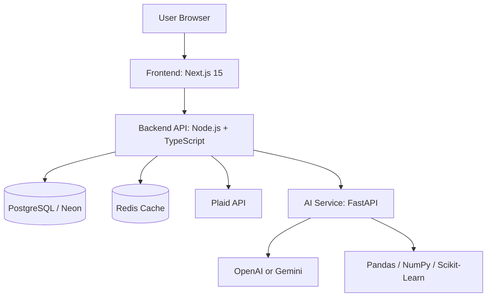

# FinSight Architecture

## System Overview

FinSight is a three-service product:

1. `frontend`: Next.js 15 application for the marketing site and authenticated dashboard
2. `backend`: Node.js + TypeScript API for auth-aware business logic, data sync, persistence, and orchestration
3. `ai-service`: Python FastAPI service for analytics, scoring, forecasting, and LLM-backed explanations



## Why This Shape

- The frontend stays focused on UX, navigation, and presentation.
- The backend owns secure integrations, session-aware orchestration, persistence, caching, and access control.
- The Python service owns the analytics engine so forecasting and scoring can become more sophisticated without contaminating the web application.
- LLMs are used after analytics to explain results, answer advisor questions, and improve categorization confidence.

## Service Responsibilities

### Frontend

- Landing page and pricing
- Authenticated dashboard shell
- Querying backend APIs
- Chart rendering with Recharts
- Chat UI and insight presentation
- Transaction filtering and editing interactions

### Backend

- Clerk session validation
- User, account, transaction, forecast, and score persistence
- Plaid link token creation and item exchange
- Transaction sync jobs and normalization
- Redis caching for dashboard payloads and analytics snapshots
- Routing requests to the AI service

### AI Service

- Financial health score calculation
- Safe-to-spend calculation
- Forecast generation for 7, 30, and 90 days
- Spending anomaly detection
- Subscription burden analysis
- Insight prompt grounding and LLM response generation

## Repository Layout

```text
FinSight/
├── frontend/
│   ├── app/
│   ├── components/
│   ├── lib/
│   ├── hooks/
│   ├── styles/
│   └── public/
├── backend/
│   ├── src/
│   │   ├── config/
│   │   ├── modules/
│   │   ├── lib/
│   │   ├── middleware/
│   │   ├── jobs/
│   │   └── routes/
│   ├── prisma/
│   └── tests/
├── ai-service/
│   ├── api/
│   ├── forecasting/
│   ├── scoring/
│   ├── insights/
│   ├── categorization/
│   ├── models/
│   ├── schemas/
│   ├── main.py
│   └── tests/
├── README.md
├── PROJECT_REQUIREMENTS.md
└── ARCHITECTURE.md
```

## Data Model

### Core Tables

`User`
- `id`
- `clerkId`
- `email`
- `firstName`
- `lastName`
- `createdAt`
- `updatedAt`

`Account`
- `id`
- `userId`
- `plaidItemId`
- `plaidAccountId`
- `institutionName`
- `name`
- `mask`
- `type`
- `subtype`
- `currentBalance`
- `availableBalance`
- `currencyCode`
- `lastSyncedAt`

`Transaction`
- `id`
- `userId`
- `accountId`
- `plaidTransactionId`
- `merchantName`
- `description`
- `amount`
- `direction`
- `categoryPrimary`
- `categoryDetailed`
- `isRecurring`
- `occurredAt`
- `pending`
- `raw`

`Subscription`
- `id`
- `userId`
- `merchantName`
- `category`
- `monthlyCost`
- `yearlyCost`
- `lastChargedAt`
- `nextExpectedAt`
- `confidence`
- `status`

`FinancialScore`
- `id`
- `userId`
- `score`
- `savingsRate`
- `spendingVolatility`
- `subscriptionBurden`
- `emergencyFundDays`
- `calculatedAt`
- `explanation`

`Forecast`
- `id`
- `userId`
- `horizonDays`
- `projectedBalance`
- `lowestProjectedBalance`
- `lowBalanceRisk`
- `riskProbability`
- `generatedAt`
- `data`

`Insight`
- `id`
- `userId`
- `type`
- `title`
- `summary`
- `severity`
- `payload`
- `createdAt`

`ChatHistory`
- `id`
- `userId`
- `role`
- `message`
- `contextSnapshot`
- `createdAt`

## API Design

### Backend Public API

`POST /api/auth/sync-user`
- Upserts the authenticated Clerk user in PostgreSQL

`POST /api/plaid/link-token`
- Creates a Plaid Link token for the signed-in user

`POST /api/plaid/exchange-public-token`
- Exchanges the public token and stores item metadata

`POST /api/plaid/sync`
- Pulls latest transactions and account balances from Plaid

`GET /api/dashboard/overview`
- Returns balance, income, spending, savings rate, score, and top insights

`GET /api/transactions`
- Paginated transactions with search and filters

`PATCH /api/transactions/:id/category`
- Manually updates a transaction category

`GET /api/subscriptions`
- Returns recurring subscriptions and savings opportunities

`GET /api/financial-health`
- Returns current score, factors, and recommendations

`GET /api/forecast`
- Returns forecast data for requested horizon

`POST /api/insights/refresh`
- Triggers the AI service to recompute insight payloads

`POST /api/chat`
- Sends a grounded financial advisor prompt and returns a response

### AI Service Internal API

`POST /analytics/score`
- Computes a financial health score from normalized balances and transactions

`POST /analytics/forecast`
- Produces 7, 30, and 90 day cash flow projections

`POST /analytics/subscriptions`
- Detects recurring merchants and computes burden metrics

`POST /analytics/insights`
- Generates grounded insight candidates from transaction trends and forecasts

`POST /analytics/chat`
- Accepts a user message plus context snapshot and returns a grounded advisor answer

`POST /analytics/categorize`
- Suggests a category for uncategorized merchants

## Analytics Strategy

### Financial Health Score

Inputs:

- Savings rate
- Spending consistency
- Subscription burden
- Emergency fund runway
- Balance trend risk

Output:

- Score from 0 to 100
- Factor breakdown for UI
- Recommendation summary

### Forecasting

Initial approach:

- Daily cash flow time series in Pandas
- Moving averages and regression baselines
- Known recurring income and bill adjustments

Future iterations:

- Seasonality-aware models
- Personalized peer benchmarking
- Better paycheck detection

### Insight Generation

1. Python computes numeric truth:
   - category deltas
   - balance risk
   - safe-to-spend
   - subscription waste
2. The backend stores those outputs.
3. The LLM translates them into concise, actionable guidance.

## Development Roadmap

### Phase 1

- Root architecture docs
- Monorepo scaffolding
- Frontend design system and routes
- Backend service skeleton
- FastAPI skeleton

### Phase 2

- Clerk integration
- Prisma schema and migrations
- Plaid sandbox flow
- Transaction normalization and persistence

### Phase 3

- Financial score engine
- Forecast engine
- Subscription detection
- AI insight and chat orchestration

### Phase 4

- Dashboard polish
- Testing and observability
- Seed data and demo readiness
- Deployment to Vercel, Railway or Render, and Neon
