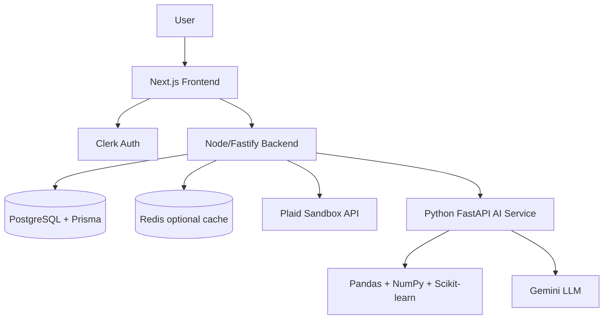

# FinSight


FinSight is an AI-powered financial copilot that connects to Plaid sandbox bank data, analyzes spending behavior, forecasts cash flow, and uses Gemini to explain financial decisions in plain English.

The product is built like a startup MVP: real authentication, real persistence, real Plaid sync, a separate Python analytics service, and a polished fintech dashboard experience.

## What It Does

- Connects bank accounts through Plaid sandbox.
- Syncs accounts, balances, and transactions into PostgreSQL.
- Calculates spending mix, cash-flow forecasts, safe-to-spend, and financial health.
- Detects subscriptions and recurring spending patterns.
- Generates weekly AI financial reports.
- Answers advisor questions with Gemini using synced financial context.
- Includes a public demo mode for quick recruiter or hackathon walkthroughs.
- Provides settings controls for service status, sync, sandbox reset, and Plaid disconnect.

## Product Screens

- `/` - landing page
- `/demo` - public demo dashboard
- `/dashboard` - authenticated overview
- `/transactions` - transaction search, filtering, and recategorization
- `/subscriptions` - recurring payment analysis
- `/financial-health` - score, factors, and recommendations
- `/advisor` - Gemini + Python financial advisor
- `/reports` - weekly AI financial report
- `/settings` - integration and data control center

## Tech Stack

**Frontend**

- Next.js App Router
- React
- TypeScript
- Tailwind CSS
- Recharts
- Clerk
- Plaid Link
- Lucide icons

**Backend**

- Node.js
- TypeScript
- Fastify
- PostgreSQL
- Prisma ORM
- Redis-ready cache layer
- Plaid API
- Clerk auth verification

**AI Service**

- Python FastAPI
- Pandas
- NumPy
- Scikit-learn
- Gemini via `google-genai`

## Architecture



FinSight is intentionally analytics-first. Python computes the numeric truth first: balances, spending deltas, forecasts, safe-to-spend, subscription burden, goal gaps, and risk indicators. Gemini then turns that grounded context into a concise explanation. That keeps the product from becoming a generic chatbot wrapper.

## Repository Structure

```text
FinSight/
├── frontend/      # Next.js product UI, auth pages, demo mode, charts
├── backend/       # Fastify API, Clerk auth, Prisma, Plaid sync, orchestration
├── ai-service/    # FastAPI analytics, scoring, forecasting, Gemini prompts
├── README.md
├── SETUP.md
├── ARCHITECTURE.md
├── DEPLOYMENT.md
└── PROJECT_REQUIREMENTS.md
```

## Local Development

Install dependencies:

```bash
npm install
```

Create env files:

```bash
cp frontend/.env.example frontend/.env.local
cp backend/.env.example backend/.env
cp ai-service/.env.example ai-service/.env
```

Generate Prisma and create tables:

```bash
cd backend
npm run db:generate
npm run db:migrate -- --name init
cd ..
```

Start the three services in separate terminals:

```bash
npm run dev:backend
```

```bash
npm run dev:frontend
```

```bash
python3 -m venv ai-service/.venv
ai-service/.venv/bin/python -m pip install -r ai-service/requirements.txt
npm run dev:ai
```

Open `http://localhost:3000`.

For the full local setup, see `SETUP.md`.

## Environment Variables

FinSight needs local env files for:

- Clerk publishable and secret keys
- PostgreSQL `DATABASE_URL`
- Plaid sandbox client id and secret
- AI service URL
- Optional Gemini API key

The checked-in `.env.example` files show the required names without exposing secrets.

## Resume-Ready Highlights

- Built a full-stack fintech application with bank data aggregation, authentication, persistence, and AI-powered analytics.
- Designed a three-service architecture with Next.js, Node/Fastify, PostgreSQL/Prisma, and Python FastAPI.
- Integrated Plaid sandbox to sync real account, balance, and transaction data.
- Implemented financial forecasting, safe-to-spend calculations, weekly reports, goal planning, and advisor chat grounded in user transaction history.
- Added Gemini as an explanation layer on top of deterministic analytics rather than relying on ungrounded chatbot responses.

## Roadmap

- Add backend API route tests.
- Add frontend component tests for dashboard and advisor workflows.
- Deploy frontend to Vercel.
- Deploy backend and AI service to Render, Railway, or Fly.io.
- Move PostgreSQL to Neon and Redis to Upstash.
- Add Plaid webhooks for background transaction sync.
- Add budget goals, notification rules, and email weekly reports.
- Harden production data retention and account deletion flows.

## Docs

- `SETUP.md` - local setup and service boot commands
- `ARCHITECTURE.md` - system design, data flow, API surface, and model overview
- `DEPLOYMENT.md` - deployment checklist for Vercel, Neon, and service hosting
- `PROJECT_REQUIREMENTS.md` - original product requirements

## Disclaimer

FinSight is an educational MVP and should not be treated as professional financial advice.
