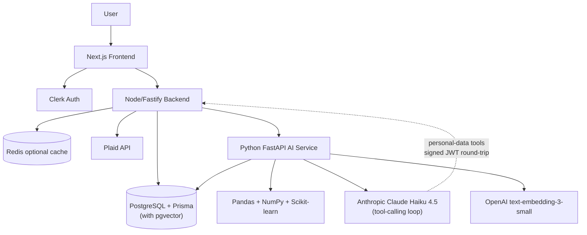

# WealthLens


WealthLens is an AI-powered financial copilot that connects to Plaid bank data, analyzes spending behavior, forecasts cash flow, and answers user questions with a real Retrieval-Augmented Generation (RAG) advisor. Claude Haiku 4.5 runs a tool-calling loop over the user's own transactions, subscriptions, balances, forecasts, and a pgvector-backed corpus of CFPB / IRS consumer-finance guides — every domain claim carries an inline `[n]` citation.

The product is built like a startup MVP: real authentication, real persistence, real Plaid sync, a separate Python analytics service, a hybrid RAG loop, and a polished fintech dashboard experience.

## What It Does

- Connects bank accounts through Plaid sandbox.
- Syncs accounts, balances, and transactions into PostgreSQL.
- Calculates spending mix, cash-flow forecasts, safe-to-spend, and financial health.
- Detects subscriptions and recurring spending patterns.
- Generates weekly AI financial reports.
- Answers advisor questions via a real RAG loop: Claude Haiku 4.5 selects from six typed tools (`searchDocs` over a pgvector corpus, plus `getTransactions`, `getSubscriptions`, `getBalance`, `getInsights`, `getForecast`) and returns replies with inline `[n]` citations linking back to CFPB / IRS source URLs.
- Includes a public demo mode for quick recruiter or hackathon walkthroughs.
- Provides settings controls for service status, sync, sandbox reset, and Plaid disconnect.

## Product Screens

- `/` - landing page
- `/demo` - public demo dashboard
- `/dashboard` - authenticated overview
- `/transactions` - transaction search, filtering, and recategorization
- `/subscriptions` - recurring payment analysis
- `/financial-health` - score, factors, and recommendations
- `/advisor` - Claude Haiku + RAG financial advisor with inline citations
- `/reports` - weekly AI financial report
- `/settings` - integration and data control center

## Tech Stack

**Frontend**

- Next.js App Router
- React
- TypeScript
- Tailwind CSS
- Recharts
- Clerk
- Plaid Link
- Lucide icons

**Backend**

- Node.js
- TypeScript
- Fastify
- PostgreSQL
- Prisma ORM
- Redis-ready cache layer
- Plaid API
- Clerk auth verification

**AI Service**

- Python FastAPI
- Pandas / NumPy / Scikit-learn (deterministic analytics: scoring, forecasting, insights)
- Anthropic Claude Haiku 4.5 (RAG answerer + tool caller)
- OpenAI `text-embedding-3-small` (1536-dim embeddings)
- pgvector (cosine similarity search over the knowledge-base corpus)
- pypdf + trafilatura + tiktoken (corpus ingestion)

## Architecture



WealthLens is intentionally analytics-first. Python computes the numeric truth first: balances, spending deltas, forecasts, safe-to-spend, subscription burden, goal gaps, and risk indicators. The RAG advisor then reasons over that truth: Claude Haiku picks from typed tools — `searchDocs` fetches semantically-relevant chunks from an on-disk corpus of CFPB and IRS consumer-finance guides via pgvector cosine similarity, while personal-data tools proxy back to the backend over a short-lived HS256 JWT to read the signed-in user's transactions, subscriptions, balances, insights, and forecasts. Every domain claim in the reply carries a `[n]` citation linking to a source URL. That keeps the product from becoming a generic chatbot wrapper.

## Repository Structure

```text
WealthLens/
├── frontend/            # Next.js product UI, auth pages, demo mode, charts, AdvisorMessage w/ citations
├── backend/             # Fastify API, Clerk auth, Prisma, Plaid sync, orchestration
│   └── src/modules/chat # /api/advisor/answer + /internal/advisor/tool (JWT-signed tool callback)
├── ai-service/          # FastAPI analytics + RAG
│   ├── rag/             # embed, search, chunk, ingest, answer (Anthropic tool loop)
│   ├── schemas/rag.py   # RagRequest / RagResponse / SourceOut
│   └── ...              # scoring, forecasting, insights, categorization, llm (deprecated)
├── docs/superpowers/    # design specs + implementation plans
├── README.md
├── SETUP.md
├── ARCHITECTURE.md
├── DEPLOYMENT.md
└── PROJECT_REQUIREMENTS.md
```

## Local Development

Install dependencies:

```bash
npm install
```

Create env files:

```bash
cp frontend/.env.example frontend/.env.local
cp backend/.env.example backend/.env
cp ai-service/.env.example ai-service/.env
```

Generate Prisma and create tables:

```bash
cd backend
npm run db:generate
npm run db:migrate -- --name init
cd ..
```

Start the three services in separate terminals:

```bash
npm run dev:backend
```

```bash
npm run dev:frontend
```

```bash
python3 -m venv ai-service/.venv
ai-service/.venv/bin/python -m pip install -r ai-service/requirements.txt
npm run dev:ai
```

Open `http://localhost:3000`.

For the full local setup, see `SETUP.md`.

## Environment Variables

WealthLens needs local env files for three services.

**Frontend** (`frontend/.env.local`):
- Clerk publishable key
- `NEXT_PUBLIC_API_BASE_URL` — backend URL

**Backend** (`backend/.env`):
- Clerk publishable + secret keys
- `DATABASE_URL` — Postgres (Neon works; must have the `vector` extension enabled)
- Plaid client id + secret
- `AI_SERVICE_URL` — where the FastAPI service is reachable
- `ADVISOR_TOOL_SECRET` — 32+ byte hex secret used to sign short-lived tool JWTs (generate with `openssl rand -hex 32`)

**AI service** (`ai-service/.env`):
- `ANTHROPIC_API_KEY` — Claude Haiku for the RAG loop
- `OPENAI_API_KEY` — `text-embedding-3-small` for chunk + query embeddings
- `DATABASE_URL` — same Postgres as backend (pgvector reads/writes to `KbDocument` / `KbChunk`)
- `BACKEND_URL` — where the Fastify service is reachable

The checked-in `.env.example` files show every required name without exposing secrets. If `ANTHROPIC_API_KEY` is missing, the advisor returns a deterministic fallback message rather than crashing.

### Enable pgvector once per database

```sql
CREATE EXTENSION IF NOT EXISTS vector;
```

Then run the Prisma migration from the backend workspace (`npm run db:migrate --workspace backend`) which creates the `KbDocument` and `KbChunk` tables and the ivfflat index.

### Seed the knowledge-base corpus

```bash
cd ai-service && python -m rag.ingest              # fetch + embed + upsert
cd ai-service && python -m rag.ingest --dry-run    # preview without DB writes
cd ai-service && python -m rag.ingest --reset      # truncate corpus first
cd ai-service && python -m rag.eval                # run the 10-question golden set
```

## Resume-Ready Highlights

- Built a full-stack fintech application with bank data aggregation, authentication, persistence, deterministic analytics, and a real RAG advisor.
- Designed a three-service architecture with Next.js, Node/Fastify, PostgreSQL/Prisma+pgvector, and Python FastAPI.
- Integrated Plaid to sync real account, balance, and transaction data.
- Implemented financial forecasting, safe-to-spend calculations, weekly reports, goal planning, and a citation-backed advisor grounded in both the user's transactions and a curated CFPB/IRS knowledge base.
- Built a production RAG loop from scratch: pgvector cosine search + OpenAI embeddings + Claude Haiku tool-calling with six typed tools, short-lived HS256 JWT for the personal-data callback, and inline `[n]` citations in the frontend.

## Roadmap

Shipped:

- Backend + frontend test suites (Vitest, pytest).
- Vercel (frontend) + Render (backend + ai-service) + Neon (Postgres w/ pgvector) deployment.
- Real RAG advisor: pgvector corpus + Claude Haiku tool-calling + inline citations.

Next:

- SSE streaming for the advisor loop (spec § v2).
- Nightly cron for corpus refresh (spec § v2).
- Expand corpus to NerdWallet / Investopedia (excerpt-only, always cite-and-link).
- Prompt-cache the system prompt + tool schemas for cost optimization.
- Plaid webhooks for background transaction sync.
- Budget goals, notification rules, and email weekly reports.
- Harden production data retention and account deletion flows.

## Docs

- `SETUP.md` - local setup and service boot commands
- `ARCHITECTURE.md` - system design, data flow, API surface, and model overview
- `DEPLOYMENT.md` - deployment checklist for Vercel, Neon, and service hosting
- `PROJECT_REQUIREMENTS.md` - original product requirements

## Disclaimer

WealthLens is an educational MVP and should not be treated as professional financial advice.
